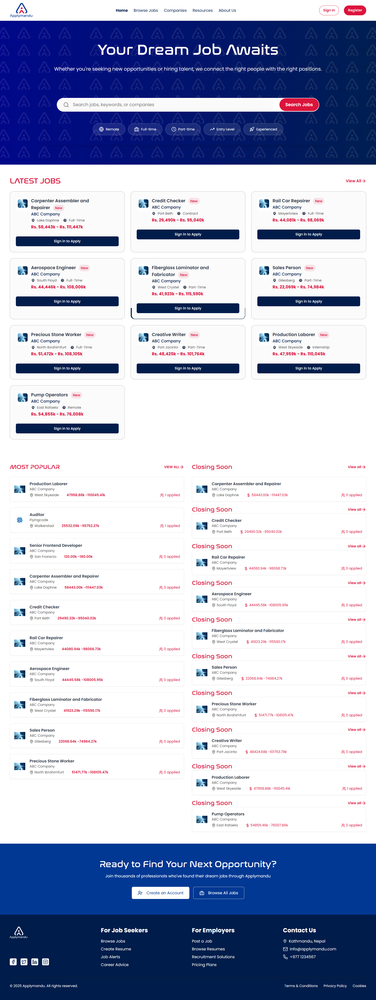
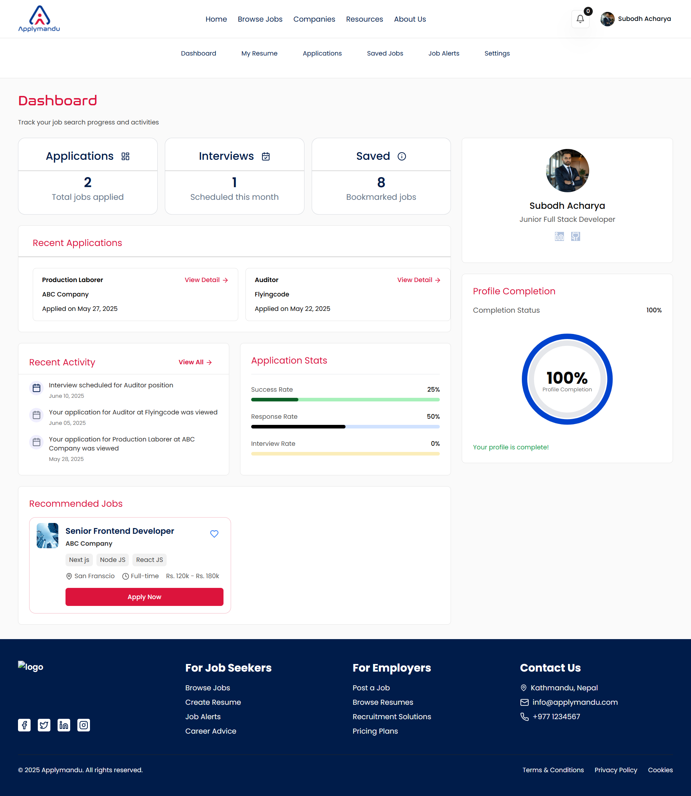
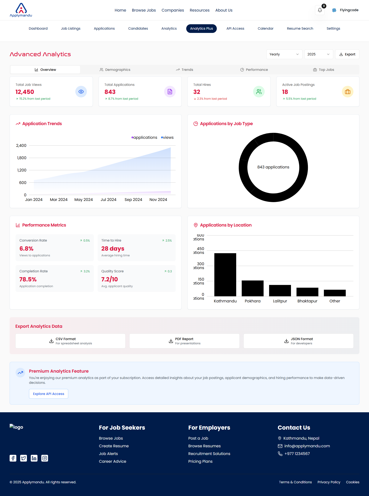
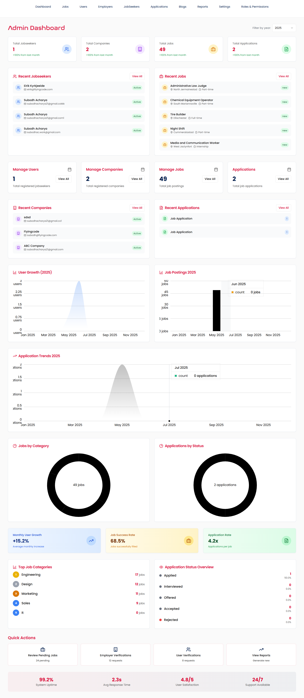

# ApplyMandu Backend

ApplyMandu is a comprehensive job portal connecting employers and job seekers with rich features such as advanced job alerts, resume management, interview scheduling, chat functionality, and more. This repository contains the backend API service, built with **Laravel**.

---

## 📈 Screenshots

| Homepage                                    | Job Seeker Login                                       | Employer Dashboard                                              | Admin Dashboard                                        |
| ------------------------------------------- | ------------------------------------------------------ | --------------------------------------------------------------- | ------------------------------------------------------ |
| [](./public/readme/homepage.png) | [](./public/readme/login-jobseeker.png) | [](./public/readme/employer-dashboard.png) | [](./public/readme/admin-dashboard.png) |

---

## 📁 Project Structure Overview

This project follows a modular Laravel architecture. Here's a summary of major directories and their purposes:

### ✅ Core Components

* **Http/**

  * `Controllers/`: All API endpoints, including authentication, dashboard, and admin.
  * `Middleware/`: Custom request filters (roles, permissions, rate-limiting).
  * `Requests/`: Form request validation.
  * `Resources/`: API resource transformation for clean JSON output.

* **Models/**

  * All Eloquent models representing the system's entities (Users, Jobs, Applications, etc.).
  * Includes custom scopes for filtering queries.

* **Enums/**

  * Enum-like classes (e.g., DegreeLevel) for type-safe value definitions.

* **Events/** & **Listeners/**

  * Implements Laravel's event-driven architecture (e.g., Job Alerts, Email Verification).

* **Mail/**

  * Custom mailable classes for email notifications.

* **Notifications/**

  * Laravel notification classes for system alerts (e.g., new job matches).

* **Jobs/** & **Services/**

  * Asynchronous job processing (e.g., job alert matching).
  * Service classes for encapsulating business logic.

* **Helpers/**

  * Utility classes for string manipulation, cache management, etc.

* **Traits/**

  * Shared logic (e.g., file uploads, authentication handling).

* **Console/**

  * Custom Artisan commands (e.g., `CreateAdminUser`).

* **Providers/**

  * Service providers to bootstrap application services.

* **Constants/**

  * Static class-based constants (e.g., Skills list).

---

## ⚙️ Installation

### 1. Clone the Repository

```bash
git clone https://github.com/yourusername/applymandu-backend.git
cd applymandu-backend
```

### 2. Install Dependencies

```bash
composer install
```

### 3. Configure Environment

Copy the example environment file and update values as needed:

```bash
cp .env.example .env
php artisan key:generate
```

Update your `.env` file with:

* Database credentials
* Mail settings
* API keys
* Redis, queue, or cache settings (if used)

### 4. Run Migrations

```bash
php artisan migrate
```

### 5. Seed Data (optional)

```bash
php artisan db:seed
```

### 6. Run the Development Server

```bash
php artisan serve
```

---

## 🚀 Features

* User authentication (Job Seekers, Employers, Admins)
* Email verification and password reset
* Job posting and management
* Resume and profile management
* Chat and messaging system
* Role & permission middleware
* Job alerts and recommendations
* Interview scheduling and calendar events
* Admin dashboard and impersonation
* Rate limiting and API key management

---

## 📬 Scheduled Jobs & Queue

This app uses Laravel queues and jobs. Make sure to run the queue worker if jobs like `JobAlertMatching` are scheduled:

```bash
php artisan queue:work
```

To schedule jobs (e.g., via cron):

```bash
* * * * * php /path-to-project/artisan schedule:run >> /dev/null 2>&1
```

---

## 🧪 Testing

Run test suite:

```bash
php artisan test
```

---

## 📄 License

This project is proprietary and all rights are reserved by ApplyMandu unless explicitly stated otherwise.

---

## 👨‍💼 Contributing

1. Fork the repository
2. Create a new branch: `git checkout -b feature/your-feature-name`
3. Commit your changes: `git commit -am 'Add feature'`
4. Push to the branch: `git push origin feature/your-feature-name`
5. Open a pull request

---

## 📞 Contact

For issues or feature requests, please reach out to the ApplyMandu dev team or file an issue on this repository.
